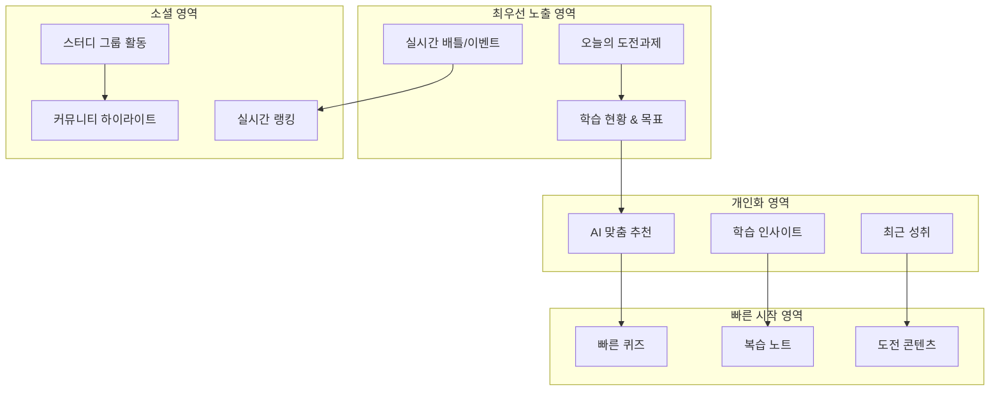

메인 홈을 사용자 동기부여와 참여도를 극대화하는 방향으로 재구성해보겠습니다.


    
메인 홈 상세 구성:

1. 최우선 노출 영역 (상단)

```
오늘의 도전과제
- 일일 학습 목표
- 도전 가능한 퀘스트
- 즉시 보상 미션

학습 현황 & 목표
- 진행 중인 학습
- 목표 달성률
- 다음 레벨까지

실시간 배틀/이벤트
- 진행 중인 대회
- 참여 가능한 배틀
- 특별 이벤트
```

2. 개인화 영역 (중앙)

```
AI 맞춤 추천
- 최적 학습 콘텐츠
- 맞춤형 난이도
- 취약점 보완 추천

학습 인사이트
- 학습 패턴 분석
- 효율성 리포트
- 개선 포인트

최근 성취
- 획득한 배지
- 달성한 목표
- 새로운 기록
```

3. 소셜 영역 (우측)

```
스터디 그룹 활동
- 그룹 최신 소식
- 협동 미션 현황
- 팀 활동 알림

커뮤니티 하이라이트
- 인기 게시물
- 유저 제작 콘텐츠
- 성공 사례

실시간 랭킹
- 주간 리더보드
- 친구 순위
- 명예의 전당
```

4. 빠른 시작 영역 (하단)

```
빠른 퀴즈
- 추천 문제
- 5분 퀴즈
- 복습 문제

복습 노트
- 오답 리마인드
- 복습 예정 항목
- 개념 정리

도전 콘텐츠
- 신규 콘텐츠
- 한정 도전과제
- 특별 미션
```

사용자 동기부여 요소:

1. 즉각적 참여 유도

- 원클릭 시작 가능한 퀴즈
- 실시간 대결 참여
- 빠른 보상 획득

2. 성취감 강화

- 시각적 진행 상황
- 단계별 목표 달성
- 다양한 보상 시스템

3. 소셜 인터랙션

- 실시간 경쟁 요소
- 협동 학습 기회
- 커뮤니티 참여

4. 개인화된 경험

- AI 기반 맞춤 추천
- 학습 패턴 분석
- 개인별 목표 관리

UI/UX 고려사항:

1. 레이아웃 최적화

- 중요 정보 우선 배치
- 직관적 네비게이션
- 반응형 디자인

2. 상호작용 디자인

- 부드러운 애니메이션
- 명확한 피드백
- 쉬운 접근성

3. 콘텐츠 표현

- 동적 데이터 업데이트
- 시각적 프로그레스
- 감성적 디자인 요소

기대 효과:

1. 사용자 참여 증가

- 즉각적 액션 유도
- 명확한 목표 제시
- 지속적 보상 제공

2. 학습 효율성 향상

- 맞춤형 학습 경로
- 효과적인 복습
- 체계적 진도 관리

3. 커뮤니티 활성화

- 활발한 상호작용
- 콘텐츠 생산 촉진
- 건강한 경쟁 유도

이러한 메인 홈 구성을 통해 사용자들의 자발적 참여와 지속적인 학습 동기를 유도할 수 있을 것으로 기대됩니다. 특정 섹션이나 기능에 대해 더 상세한 논의가 필요하신가요?
