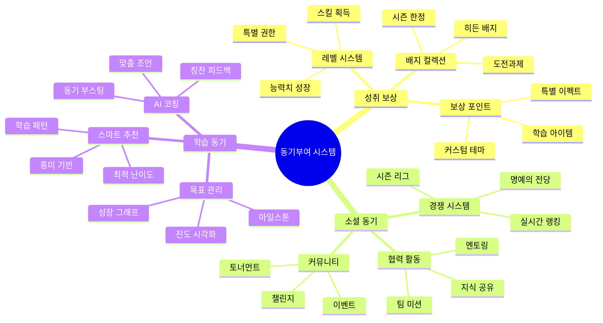

사용자 동기부여와 참여도를 높이기 위한 전략적 아이디어를 제안하겠습니다.


        
상세 동기부여 전략:

1. 즉각적 보상 시스템 강화

```
일일 보상
- 출석 체크 보상 다양화
- 일일 미션 달성 보상
- 연속 학습 스트릭 보상

단계별 보상
- 레벨업 특별 보상
- 스킬 마스터 보상
- 진도율 달성 보상

희소성 보상
- 한정판 배지
- 시즌 특별 아이템
- 이벤트 전용 테마
```

2. 사회적 상호작용 강화

```
경쟁 요소
- 실시간 대결 매칭
- 주간/월간 랭킹 시스템
- 팀 기반 리그전

협력 활동
- 그룹 미션 보상
- 지식 공유 포인트
- 협동 학습 성과

커뮤니티 활성화
- 유저 제작 콘텐츠 보상
- 커뮤니티 기여도 시스템
- 인플루언서 프로그램
```

3. 개인화된 동기부여 시스템

```
맞춤형 목표 설정
- AI 기반 적정 목표 제안
- 단계별 마일스톤 설정
- 유연한 목표 조정

성취 시각화
- 상세 성장 그래프
- 스킬트리 진행도
- 역량 레이더 차트

동기부여 메시지
- AI 기반 칭찬 시스템
- 상황별 응원 메시지
- 개인화된 피드백
```

4. 게임적 요소 강화

```
캐릭터 성장
- 능력치 시스템
- 장비/아이템 수집
- 특수 스킬 해금

퀘스트 시스템
- 메인 퀘스트 (학습 로드맵)
- 서브 퀘스트 (부가 활동)
- 일일 퀘스트 (단기 목표)

성취 시스템
- 업적 달성
- 타이틀 획득
- 특별 미션
```

5. 참여 촉진 전략

```
시간 제한 요소
- 일일 도전 과제
- 기간 한정 이벤트
- 시즌제 콘텐츠

단계적 난이도
- 적응형 난이도 조절
- 점진적 도전 과제
- 성취감 최적화

소셜 프루프
- 성공 사례 공유
- 학습 노하우 공유
- 성과 인증
```

6. 습관 형성 지원

```
루틴 시스템
- 맞춤형 학습 루틴 제안
- 습관 형성 트래커
- 연속 달성 보상

마일스톤 관리
- 단기/중기/장기 목표
- 진행 상황 시각화
- 성취 축하 이벤트

피드백 루프
- 실시간 진도 확인
- 주간 성과 리포트
- 월간 성장 분석
```

기대 효과:

1. 학습 지속성 향상

- 규칙적인 학습 습관 형성
- 장기적 참여 동기 유지
- 학습 효율성 증가

2. 사용자 만족도 증가

- 성취감 극대화
- 소속감 강화
- 자기 효능감 향상

3. 플랫폼 활성화

- 사용자 간 상호작용 증가
- 콘텐츠 생산 촉진
- 커뮤니티 활성화

이러한 동기부여 시스템을 통해 사용자들의 지속적인 참여와 성장을 유도할 수 있을 것으로 기대됩니다. 특정 요소에 대해 더 상세한 논의가 필요하신가요?
