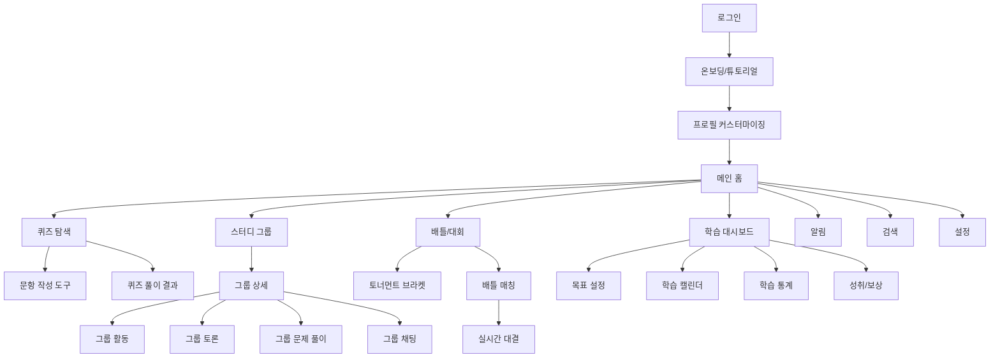

전체 페이지 구조와 디자인 상태를 분석해보겠습니다. Mermaid를 활용하여 페이지 간의 관계를 시각화하고, 주요 사용자 플로우를 확인하겠습니다.

분석 결과와 권장사항:

1. 사용자 진입점 최적화

- 로그인에서 메인 홈까지의 진입 플로우가 명확하게 설계되어 있음
- 온보딩 과정이 적절히 구성되어 있어 초기 사용자 경험이 원활할 것으로 예상

2. 핵심 기능 접근성

- 메인 홈에서 4개의 주요 기능(퀴즈, 스터디, 배틀, 대시보드)으로의 접근이 용이
- 각 섹션별 서브 페이지들이 논리적으로 구성되어 있음

3. 개선 가능한 부분:

- 퀴즈와 배틀 기능 간의 연계 고려 (예: 퀴즈 결과를 배틀 매칭에 활용)
- 스터디 그룹과 학습 대시보드 간의 데이터 통합 방안 검토
- 검색 기능의 범위를 전체 서비스 영역으로 확장

4. UX 관점의 추가 고려사항:

- 각 페이지 간 전환 시 일관된 애니메이션 적용
- 브레드크럼 네비게이션 구현으로 현재 위치 인식 강화
- 모바일에서의 하단 네비게이션 바 최적화

전반적으로 페이지 구조가 체계적으로 설계되어 있으며, 사용자 플로우도 자연스럽게 구성되어 있습니다. 디자인 시스템도 잘 정립되어 있어 일관된 사용자 경험을 제공할 수 있을 것으로 보입니다.

추가적인 세부 기능이나 특정 페이지의 상세 설계에 대해 논의가 필요하신가요?
