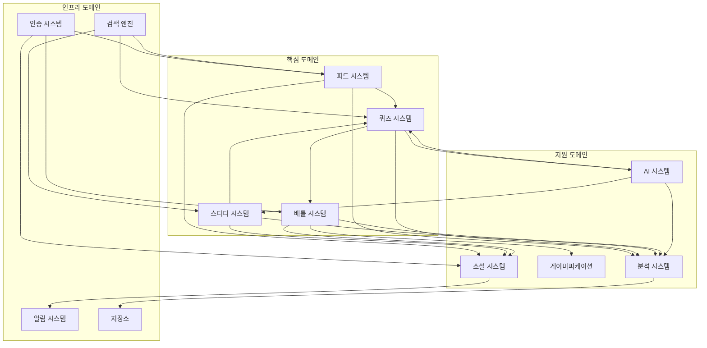

설계한 시스템의 전체 연계성을 검토하고 시각화하겠습니다.


시스템 연계성 상세 분석:

1. 데이터 흐름 연계

```
사용자 활동 데이터
└─ 피드 시스템 → 분석 시스템
└─ 퀴즈 시스템 → AI 시스템
└─ 학습 활동 → 게이미피케이션

컨텐츠 데이터
└─ 퀴즈 생성 → 피드 공유
└─ 스터디 활동 → 소셜 피드
└─ 배틀 결과 → 랭킹 시스템

사용자 상호작용
└─ 소셜 활동 → 알림 시스템
└─ 검색 활동 → 추천 시스템
└─ 학습 패턴 → AI 코칭
```

2. 기능적 연계

```
학습 시스템
├─ 퀴즈 풀이 → 성과 분석
├─ AI 추천 → 맞춤 학습
└─ 복습 시스템 → 진도 관리

소셜 시스템
├─ 그룹 활동 → 협업 학습
├─ 피드 공유 → 커뮤니티 활성화
└─ 배틀 매칭 → 경쟁 학습

게이미피케이션
├─ 성과 달성 → 보상 시스템
├─ 랭킹 관리 → 동기 부여
└─ 배지 획득 → 참여 촉진
```

3. 시스템 간 상호작용

```
피드 시스템
↔ 퀴즈 시스템: 문제 공유, 풀이 현황
↔ 소셜 시스템: 활동 공유, 상호작용
↔ 분석 시스템: 사용자 행동 분석

퀴즈 시스템
↔ AI 시스템: 문제 추천, 난이도 조정
↔ 분석 시스템: 학습 패턴 분석
↔ 배틀 시스템: 실시간 대결

스터디 시스템
↔ 소셜 시스템: 그룹 활동, 멤버 관리
↔ 분석 시스템: 그룹 성과 분석
↔ AI 시스템: 학습 최적화
```

4. 개선 필요 사항:

1) 실시간 처리 강화

- 배틀 시스템 실시간성
- 알림 전달 최적화
- 피드 업데이트 속도

2) 데이터 동기화

- 시스템 간 상태 관리
- 캐시 전략 수립
- 정합성 보장

3) 확장성 고려

- 마이크로서비스 구조
- API 게이트웨이
- 로드밸런싱

5. 성능 최적화 포인트:

1) 데이터 처리

- 배치 프로세싱
- 캐싱 전략
- 인덱싱 최적화

2) 네트워크 최적화

- CDN 활용
- 압축 전송
- Connection Pooling

3) 애플리케이션 최적화

- 코드 스플리팅
- 레이지 로딩
- 메모리 관리

6. 모니터링 계획:

1) 시스템 모니터링

- 성능 메트릭
- 에러 로깅
- 리소스 사용량

2) 사용자 행동 분석

- 사용 패턴
- 피드백 수집
- 만족도 조사

3) 서비스 품질 관리

- 응답 시간
- 가용성
- 안정성

이러한 연계성 분석을 통해 시스템의 개선점과 최적화 방향을 파악할 수 있습니다. 특정 영역에 대해 더 상세한 검토가 필요하신가요?
