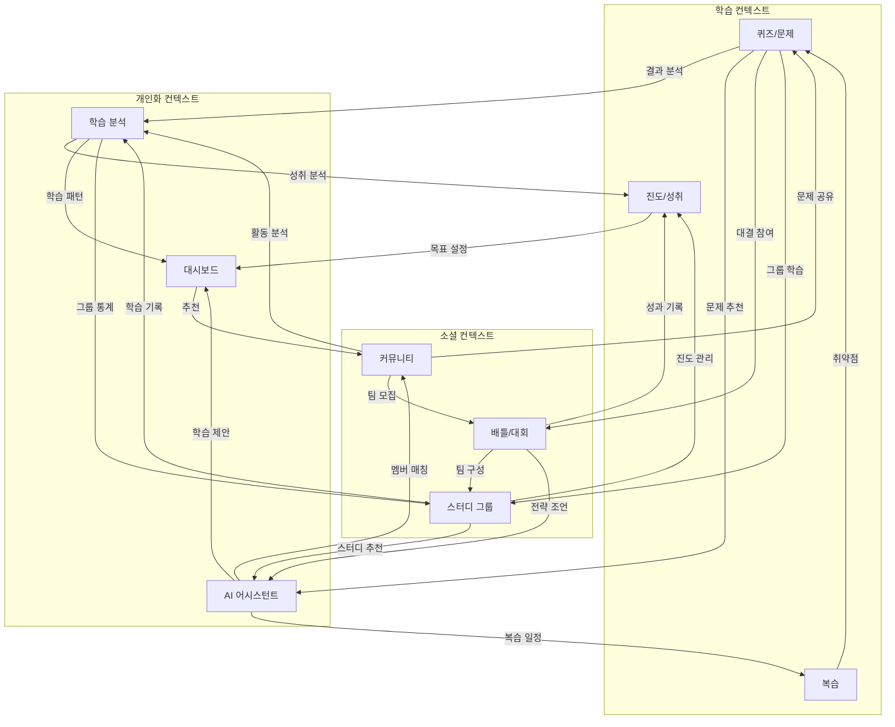

페이지 간 연계성을 체계적으로 설계하여 자연스러운 사용자 경험을 만들어보겠습니다.


    
주요 연계성 설계 전략:

1. 학습 컨텍스트 연계

- 퀴즈 풀이 → 자동 복습 일정 생성
- 오답 분석 → AI 맞춤형 문제 추천
- 학습 진도 → 스킬트리 업데이트
- 성취 달성 → 게이미피케이션 보상

2. 소셜 컨텍스트 연계

- 개인 퀴즈 결과 → 배틀 매칭 추천
- 스터디 활동 → 팀 배틀 참여
- 커뮤니티 기여 → 멘토링 기회
- 그룹 성과 → 리그 순위 반영

3. 개인화 컨텍스트 연계

- 학습 패턴 → AI 조언 최적화
- 성취 데이터 → 맞춤형 목표 제안
- 활동 분석 → 스터디 그룹 추천
- 집중도 분석 → 학습 환경 조정

상호작용 시나리오 예시:

1. 퀴즈 풀이 후 연계

```
퀴즈 완료
↓
성적 분석 (Analytics)
↓
AI 피드백 (AI 어시스턴트)
↓
맞춤형 복습 일정 (스마트 복습)
↓
관련 스터디 그룹 추천 (소셜 러닝)
```

2. 배틀 참여 후 연계

```
배틀 완료
↓
결과 기록 (Progress)
↓
실력 분석 (Analytics)
↓
맞춤형 연습 추천 (AI 어시스턴트)
↓
다음 대회 안내 (커뮤니티)
```

3. 스터디 활동 후 연계

```
그룹 학습 완료
↓
진도 업데이트 (학습 맵)
↓
그룹 분석 (Analytics)
↓
다음 활동 추천 (AI 어시스턴트)
↓
팀 배틀 매칭 (소셜 러닝)
```

UX 최적화 전략:

1. 자연스러운 전환

- 컨텍스트 유지 전환
- 히스토리 백 지원
- 진행 상태 유지

2. 데이터 연속성

- 크로스 페이지 데이터 공유
- 상태 동기화
- 실시간 업데이트

3. 인터랙션 디자인

- 부드러운 애니메이션
- 명확한 피드백
- 직관적 네비게이션

이러한 연계성 설계를 통해 사용자는 자연스럽게 다양한 기능을 탐색하고 활용할 수 있을 것입니다. 특정 연계 흐름이나 상호작용에 대해 더 상세한 논의가 필요하신가요?
