제안된 추가 기능들을 포함한 전체 페이지 구조를 체계적으로 정리하겠습니다.

```mermaid
graph TD
    %% 1. 시작 흐름
    Login[로그인] --> Onboarding[온보딩/튜토리얼]
    Onboarding --> Profile[프로필 커스터마이징]
    Profile --> Home[메인 홈]
    
    %% 2. 메인 네비게이션
    Home --> Quiz[퀴즈 탐색]
    Home --> Study[스터디 그룹]
    Home --> Battle[배틀/대회]
    Home --> Dashboard[학습 대시보드]
    
    %% 3. AI 어시스턴트
    Dashboard --> AIAssist[AI 학습 어시스턴트]
    AIAssist --> PersonalAdvice[개인화 학습 조언]
    AIAssist --> WeakPoint[취약점 분석]
    AIAssist --> AutoReview[자동 오답노트]
    
    %% 4. 게이미피케이션
    Dashboard --> RPGSystem[학습 RPG]
    RPGSystem --> Character[캐릭터/스킬]
    RPGSystem --> Quest[퀘스트/미션]
    RPGSystem --> Items[아이템/배지]
    RPGSystem --> League[시즌 리그]
    
    %% 5. 소셜 러닝
    Study --> CoopLearn[협동 학습]
    CoopLearn --> TeamBattle[팀 배틀]
    CoopLearn --> Mentoring[멘토링]
    CoopLearn --> Knowledge[지식 공유]
    
    %% 6. 학습 맵
    Dashboard --> LearningMap[학습 맵]
    LearningMap --> SkillTree[스킬트리]
    LearningMap --> Progress[진도 미니맵]
    LearningMap --> Timeline[마일스톤]
    
    %% 7. 스마트 복습
    Quiz --> SmartReview[스마트 복습]
    SmartReview --> Spacing[간격 복습]
    SmartReview --> Flashcards[플래시카드]
    SmartReview --> VoiceLearning[음성 학습]
    SmartReview --> MindMap[마인드맵]
    
    %% 8. 인터랙티브 도구
    Quiz --> Interactive[인터랙티브 도구]
    Interactive --> LiveQuiz[라이브 퀴즈]
    Interactive --> Whiteboard[화이트보드]
    Interactive --> VoiceRecord[음성/영상]
    Interactive --> ARQuiz[AR 퀴즈]
    
    %% 9. 분석 도구
    Dashboard --> Analytics[학습 분석]
    Analytics --> Pattern[학습 패턴]
    Analytics --> Focus[집중도]
    Analytics --> OptimalTime[최적 시간]
    Analytics --> Growth[성장 로드맵]
    
    %% 10. 커뮤니티
    Home --> Community[커뮤니티]
    Community --> Contest[문제 공모전]
    Community --> Challenge[주간 챌린지]
    Community --> QnA[실시간 QnA]
    
    %% 11. 공통 기능
    Home --> Settings[설정]
    Home --> Notifications[알림]
    Home --> Search[검색]
```

페이지별 주요 기능 설명:

1. AI 학습 어시스턴트 섹션

- 개인화 학습 조언 페이지: 학습 데이터 기반 맞춤형 조언
- 취약점 분석 페이지: 상세 분석 및 개선 전략
- 자동 오답노트: AI 기반 오답 분석 및 복습 계획

2. 게이미피케이션 섹션

- 캐릭터/스킬 페이지: 캐릭터 커스터마이징 및 스킬 트리
- 퀘스트/미션 페이지: 일일/주간/월간 미션 관리
- 시즌 리그 페이지: 랭킹 및 리그 시스템

3. 소셜 러닝 섹션

- 협동 학습 페이지: 그룹 학습 활동 관리
- 팀 배틀 페이지: 팀 기반 경쟁 학습
- 멘토링 페이지: 멘토-멘티 매칭 및 관리

4. 학습 맵 섹션

- 스킬트리 페이지: 과목별 학습 경로 시각화
- 진도 미니맵: 전체 진도율 시각화
- 마일스톤 페이지: 주요 성취 지표 관리

5. 스마트 복습 섹션

- 간격 복습 페이지: 최적화된 복습 일정
- 플래시카드 페이지: 자동 생성 학습 카드
- 마인드맵 페이지: 개념 연결 시각화

6. 분석 도구 섹션

- 학습 패턴 페이지: 상세 학습 분석 리포트
- 집중도 페이지: 학습 효율성 분석
- 성장 로드맵: 개인화된 학습 계획

추가적으로 고려할 사항:

1. 페이지 간 연계성

- 자연스러운 페이지 전환 흐름
- 크로스 기능 통합
- 일관된 사용자 경험

2. 반응형 구현

- 모바일 최적화
- 태블릿 지원
- 데스크톱 레이아웃

3. 성능 최적화

- 데이터 선로딩
- 캐싱 전략
- 페이지 로딩 속도

각 섹션별 상세 기능이나 특정 페이지의 구현 방향에 대해 더 자세한 논의가 필요하신가요?
