네, 모든 페이지의 연결 상태와 연계성을 체계적으로 정리해보겠습니다.

```mermaid
graph TD
    %% 메인 섹션
    Login[로그인] --> Home[메인 홈]
    Home --> |학습하기| Learning[학습 섹션]
    Home --> |소셜| Social[소셜 섹션]
    Home --> |개인화| Personal[개인화 섹션]
    
    %% 학습 섹션 상세
    Learning --> Quiz[퀴즈/문제]
    Learning --> Review[복습 시스템]
    Learning --> Progress[학습 진도]
    
    Quiz --> |결과분석| Review
    Quiz --> |진도반영| Progress
    Quiz --> |AI분석| AI[AI 어시스턴트]
    
    %% 소셜 섹션 상세
    Social --> Battle[배틀/대회]
    Social --> Community[커뮤니티]
    Social --> Group[스터디 그룹]
    
    Battle --> |팀구성| Group
    Battle --> |랭킹| Community
    Battle --> |전략추천| AI
    
    %% 개인화 섹션 상세
    Personal --> Dashboard[대시보드]
    Personal --> AI
    Personal --> Analytics[학습 분석]
    
    Dashboard --> |맞춤조언| AI
    Dashboard --> |데이터분석| Analytics
    Dashboard --> |목표관리| Progress
    
    %% 크로스 섹션 연결
    Quiz -.->|문제공유| Community
    Group -.->|그룹학습| Quiz
    Analytics -.->|추천| Battle
    AI -.->|최적화| Review
```


    
페이지별 상세 연계성 리스트:

1. 메인 홈 연계

- 학습 섹션 진입
  - 최근 학습 내용 연동
  - 추천 퀴즈 표시
  - 학습 목표 현황
- 소셜 섹션 진입
  - 친구 활동 피드
  - 실시간 배틀 현황
  - 그룹 알림
- 개인화 섹션 진입
  - AI 추천 요약
  - 주요 분석 지표
  - 개인 알림

2. 학습 섹션 연계

```
퀴즈/문제 페이지
└─ 복습 시스템 (오답 연동)
└─ 학습 진도 (진척도 반영)
└─ AI 어시스턴트 (문제 추천)
└─ 커뮤니티 (문제 공유)

복습 시스템
└─ AI 어시스턴트 (일정 최적화)
└─ 학습 분석 (효율성 측정)
└─ 진도 관리 (복습 현황)

학습 진도
└─ 대시보드 (목표 대비)
└─ 분석 리포트 (진도율)
└─ 스터디 그룹 (그룹 진도)
```

3. 소셜 섹션 연계

```
배틀/대회 페이지
└─ 스터디 그룹 (팀 구성)
└─ 커뮤니티 (랭킹/결과)
└─ AI 어시스턴트 (전략 추천)
└─ 학습 분석 (실력 분석)

커뮤니티 페이지
└─ 퀴즈/문제 (콘텐츠 공유)
└─ 스터디 그룹 (모집/홍보)
└─ 배틀 시스템 (대회 소식)

스터디 그룹 페이지
└─ 퀴즈/문제 (그룹 학습)
└─ 학습 분석 (그룹 통계)
└─ AI 어시스턴트 (활동 추천)
```

4. 개인화 섹션 연계

```
대시보드 페이지
└─ AI 어시스턴트 (맞춤 조언)
└─ 학습 분석 (데이터 시각화)
└─ 진도 관리 (목표 설정)

AI 어시스턴트 페이지
└─ 복습 시스템 (일정 조정)
└─ 퀴즈/문제 (난이도 조절)
└─ 배틀 시스템 (전략 제시)

학습 분석 페이지
└─ 대시보드 (주요 지표)
└─ 스터디 그룹 (비교 분석)
└─ 진도 관리 (추세 분석)
```

크로스 기능 연계:

1. 데이터 연동

- 학습 활동 → 분석 시스템
- 소셜 활동 → 추천 시스템
- 개인 설정 → 맞춤화 시스템

2. 기능 통합

- 퀴즈 + 배틀 = 실시간 대결
- 복습 + AI = 스마트 학습
- 그룹 + 분석 = 협업 인사이트

3. 알림 시스템

- 학습 일정 알림
- 소셜 활동 알림
- 성취 달성 알림

이러한 페이지 간 연계성을 통해:

1. 자연스러운 사용자 경험
2. 기능 간 시너지 효과
3. 지속적인 사용자 참여
4. 효율적인 학습 관리

가 가능할 것으로 예상됩니다. 특정 연계 지점이나 기능 통합에 대해 더 상세한 논의가 필요하신가요?
